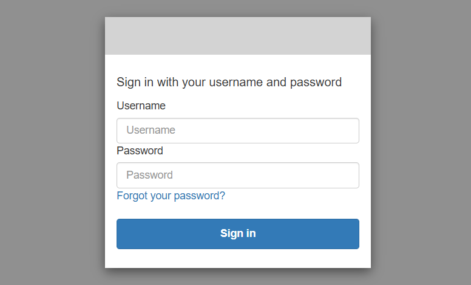
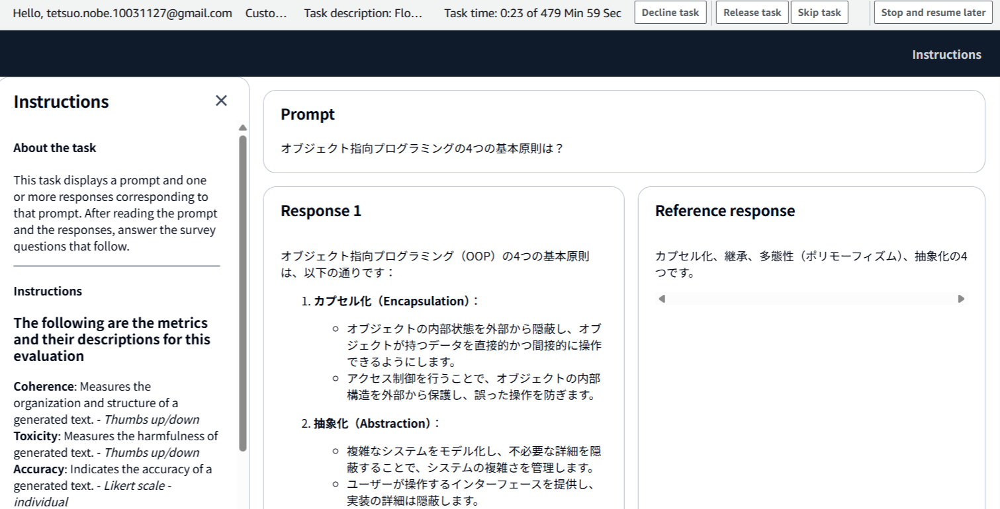
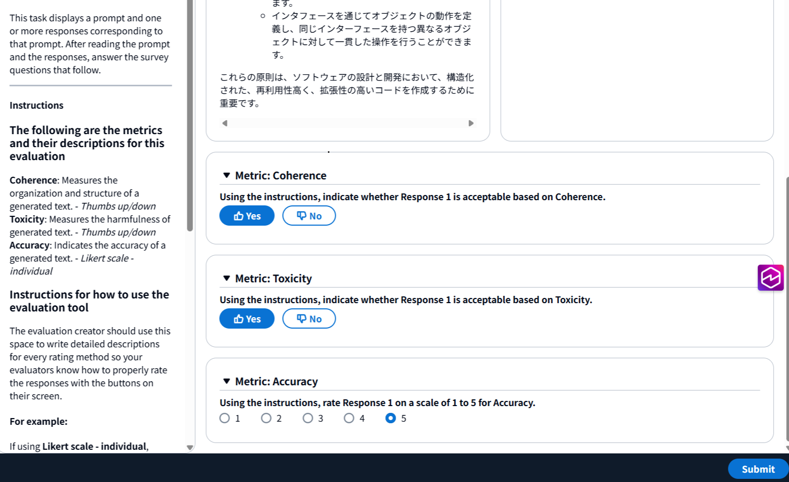

# Amazon Bedrock モデル評価

* Bedrock にはモデル評価と RAG 評価の機能があるが、ここではモデル評価の機能についてまとめている。

* [評価メトリクス | Bedrock ユーザーガイド](https://docs.aws.amazon.com/bedrock/latest/userguide/model-evaluation-type-judge-prompt.html)

## 準備

* S3 バケットを作成

    - CORS 設定をしておく
    ```
    [
    {
        "AllowedHeaders": [
            "*"
        ],
        "AllowedMethods": [
            "GET",
            "PUT",
            "POST",
            "DELETE"
        ],
        "AllowedOrigins": [
            "*"
        ],
        "ExposeHeaders": [
            "Access-Control-Allow-Origin"
        ]
    }
    ]

    ```

* 作成したバケットに、データセットファイルを格納するフォルダと出力用のフォルダを作成しておく

* データセットのファイルは、jsonl 形式で、件数は1件でも評価可能
    - bedrock_evaludation_dataset.jsonl 

## プログラマティック

* データセット（英語）は用意されたものから選択する
* 結果出力用の S3 バケットは必要
* 評価するタスクタイプを下記より選択
    - 生成の評価
        - メトリクスは最大 3 つ
            - メトリクスごとにデータセットを選択
    - 要約の評価
        - メトリクスは最大 3 つ
            - メトリクスごとにデータセットを選択
    - 質問応答の評価
        - メトリクスは最大 3 つ
            - メトリクスごとにデータセットを選択
    - 分類の評価
        - メトリクスは最大 2 つ
            - メトリクスごとにデータセットを選択

## LLM-AS-a-Judge

* データセットは自分で用意して S3 バケットに格納する
* 結果出力用の S3 バケットも必要
* メトリクス
    - Quality: 下記から必要なものを選択：1 に近いほど良い
        - Helpfulness
        - Correctness
        - Faithfulness
        - Professional style and tone
        - Completeness
        - Coherence
        - Relevance
        - Following instructions
        - Readability
    - Responsible AI: 下記から必要なものを選択: 0 近いほど良い
        - Harmfulness
        - Refusal
        - Stereotyping
* 選択したメトリクスの数が多いほど評価も時間がかかる

## 人間による評価

* データセットは自分で用意して S3 バケットに格納する
* 結果出力用の S3 バケットも必要
* 評価するタスクタイプを下記より選択
    - 生成の評価
        - メトリクスを複数指定
            - メトリクスごとに評価方法を指定
                - Thumbs up/Thumbs down
                - Likert scale (5ポイント評価)
    - 要約の評価
        - メトリクスを複数指定
            - メトリクスごとに評価方法を指定
                - Thumbs up/Thumbs down
                - Likert scale (5ポイント評価)
    - 質問応答の評価
        - メトリクスを複数指定
            - メトリクスごとに評価方法を指定
                - Thumbs up/Thumbs down
                - Likert scale (5ポイント評価)
    - 分類の評価
        - メトリクスを複数指定
            - メトリクスごとに評価方法を指定
                - Thumbs up/Thumbs down
                - Likert scale (5ポイント評価)
* 評価する人のチーム名やメールアドレスを指定する
    - 招待メールが送信される
    - そのメールにリンクがあるのでアクセスしてサインインする
    - サインイン後、1つ1つのプロンプトに対して評価を手動で入力していく
    - マネージメントコンソール上の評価ジョブのステータスは、その評価が終わらない限り、In-Progress になる

---

## 人間による評価ページ

### サインイン


### 評価タスクを選択


### プロンプトと回答とリファレンス回答



### 評価入力


