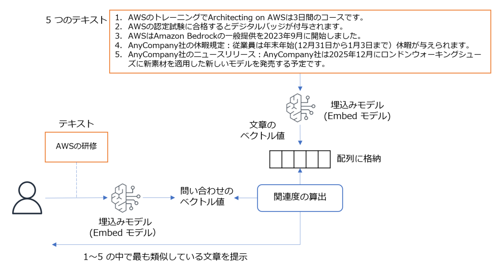

# Embed のデモ

## Embed モデルが生成するベクトルデータを活用し、指定した文章と関連性の高いテキストデータを選択します。

* 対象テキスト: documents-jp.txt に 5 つのテキストがあります。
* Embed モデル: Amazon Titan Text Embeddings V2
* ベクトルデータの生成/関連性の計算/テキストの選択: embeddings-demo.py
